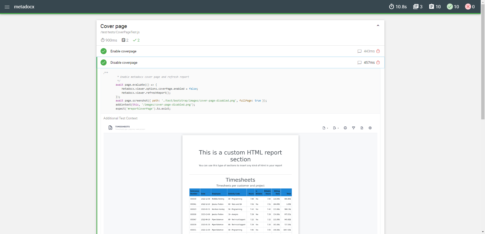

# Tests

We use puppeteer, mocha and chai to create tests cases for Metadocx. All tests are located in the /test folder of the main metadocx/reporting repository.

## Quick setup
Be sure to run `npm i` in the root directory of the project to install all required dependencies.

## Local HTTP server
We have setup a simple test site that can be launched using the following command `npm run test-server` this will create a web server on port 8080, you can then access the Metadocx report viewer by opening your web browser and typing `http://localhost:8080`

!!! Note
    The local HTTP server is required to run the tests with puppeteer

## Running the tests
You can launch all tests using the followin command `npm run test` this will execte all tests located in ./test/tests and output a report in ./test/bootstrap/report. You can access your report using the local HTTP server at the following address `http://localhost:8080`

### Example test report 
The test report is generated using mochawesome.

